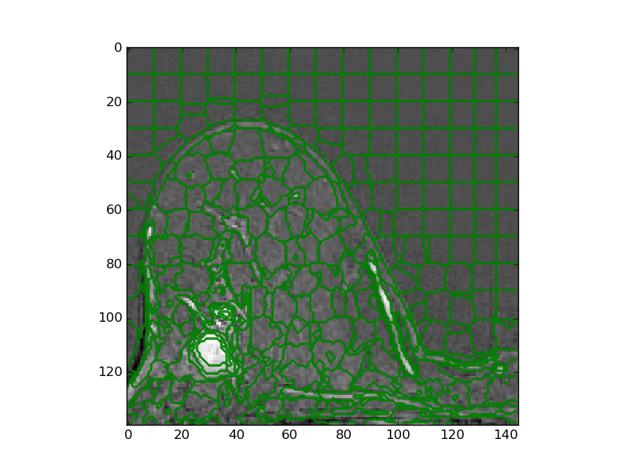

# Perfusion-SLIC
A small library to extracted supervoxels based on enhancement curves of perfusion images using principal component analysis. 
This method extends the standard SLIC implementation of scitkit-image 
(http://scikit-image.org/docs/dev/api/skimage.segmentation.html). 

For research purposes only. 

**References**

*Irving, B; Franklin, JM; Papiez, BW; Anderson, EM; Sharma, RA; Gleeson, FV; Brady, M; and Schnabel, JA. Pieces-of-parts
 for supervoxel segmentation with global context: Application to DCE-MRI tumour delineation. 
 Journal of Medical Image Analysis 2016 (accepted).*
 http://dx.doi.org/10.1016/j.media.2016.03.002

*Irving, B; Cifor, A; Papiez, BW; Franklin, J; Anderson, EM; Brady, M; and Schnabel, JA.
Automated colorectal tumour segmentation in DCE-MRI using supervoxel neighbourhood contrast characteristics. 
Proc MICCAI 2014, 8673, 609-616.*

### Requirements

python 2.7 or python 3.4+

Python libraries:
- numpy
- nibabel
- matplotlib
- h5py
- scipy
- Cython
- scikit-image
- scikit-learn
- wheel


### Installation


Option 1) Build the project in it's current location

Build Cython extensions of the library in the current location using:

```bash
python setup.py build_ext --inplace
```

Option 2) Install in your python directory
```bash
python setup.py bdist_wheel
pip install dist/perfusionslic-0.20-cp27-cp27mu-linux_x86_64.whl
```

### Demo

Download the .mat example QIN breast DCE-MRI data from: 

https://www.dropbox.com/s/318tv1a73igr1gu/QIN-Breast-DCE-MRI-BC10-V1.mat?dl=1

Run the demo script
```bash
python perfusion_slic_demo.py
```

Ouput showing the a cross section through a single slice and supervoxels:




### Source of example data:

QIN-Breast-DCE-MRI-BC10-V1.mat

From: 
https://wiki.cancerimagingarchive.net/display/Public/QIN+Breast+DCE-MRI

Licence: CC BY 3.0
(https://wiki.cancerimagingarchive.net/display/Public/Data+Usage+Policies+and+Restrictions)

*Reference*:
_Huang W, Li X, Chen Y, Li X, Chang MC, Oborski MJ, Malyarenko DI, Muzi M, Jajamovich GH, Fedorov A, Tudorica A, Gupta SN, 
Laymon CM, Marro KI, Dyvorne HA, Miller JV, Barbodiak DP, Chenevert TL, Yankeelov TE, Mountz JM, Kinahan PE, Kikinis R, 
Taouli B, Fennessy F, Kalpathy-Cramer J.  Variations of dynamic contrast-enhanced magnetic resonance imaging in evaluation 
of breast cancer therapy response: a multicenter data analysis challenge.  Trans Oncol 2014;7:153-166. PubMed PMID: 24772219; 
PubMed Central PMCID: PMC3998693_

### Acknowledgements


### TODO: 

1) Quite memory intensive for large volumes

Please contact me for any corrections or improvements

_Benjamin Irving (20141124)_